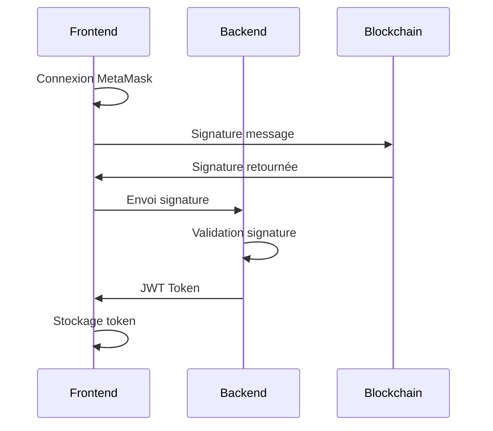
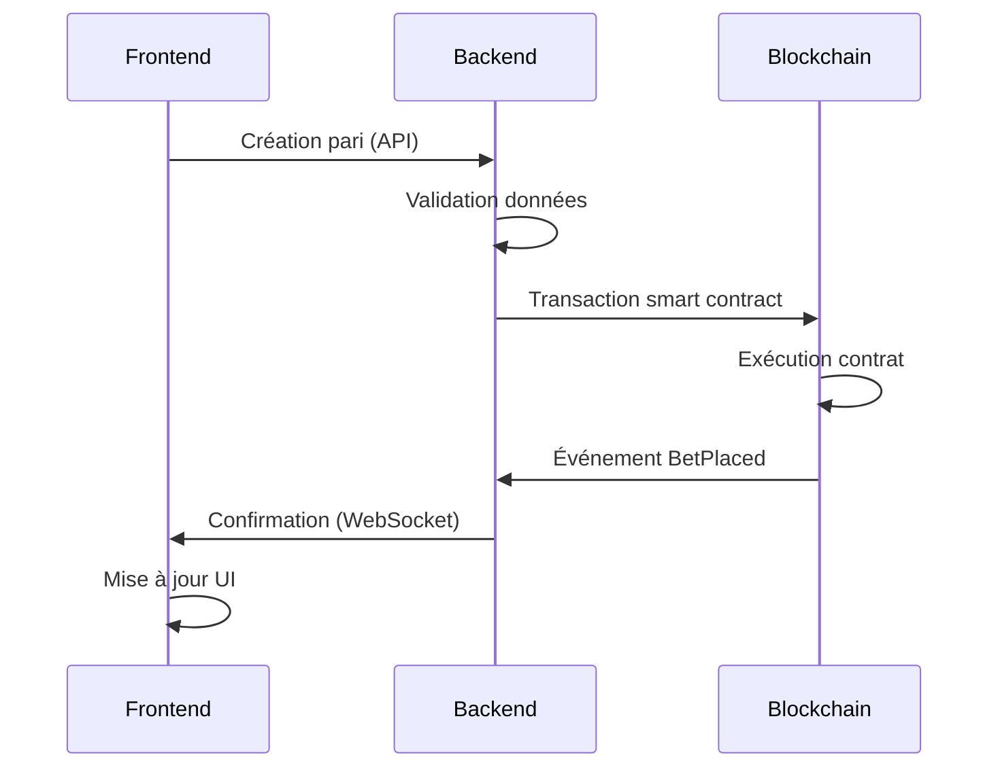
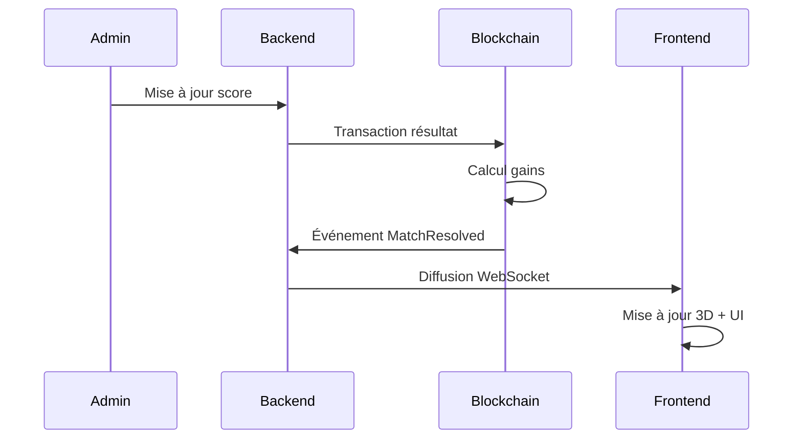

# Guide d'Intégration FanVerse

Ce document explique comment les différents services de FanVerse communiquent entre eux.

## Architecture Générale

```
┌─────────────────┐    ┌─────────────────┐    ┌─────────────────┐
│     Frontend    │    │     Backend     │    │   Blockchain    │
│   (Next.js)     │    │   (Node.js)     │    │   (Hardhat)     │
│                 │    │                 │    │                 │
│  - Interface 3D │◄──►│  - API REST     │◄──►│ - Smart Contracts│
│  - Web3 Client  │    │  - WebSocket    │    │ - Token/NFT     │
│  - État Global  │    │  - Database     │    │ - Betting       │
└─────────────────┘    └─────────────────┘    └─────────────────┘
```

## Communication entre Services

### 1. Frontend ↔ Backend

**API REST** (Port 5000)
- `/api/auth` - Authentification utilisateur
- `/api/matches` - Données des matchs
- `/api/bets` - Système de paris
- `/api/chat` - Messages du chat
- `/api/stats` - Statistiques utilisateur

**WebSocket** (temps réel)
- Mise à jour des scores en direct
- Chat en temps réel
- Notifications push
- Synchronisation des paris

**Exemple d'intégration Frontend:**
```javascript
// frontend/lib/api.js
const API_URL = process.env.NEXT_PUBLIC_API_URL || 'http://localhost:5000';

export async function fetchMatches() {
  const response = await fetch(`${API_URL}/api/matches`);
  return response.json();
}

// WebSocket connection
import io from 'socket.io-client';
const socket = io(API_URL);

socket.on('match-update', (data) => {
  // Mise à jour en temps réel
});
```

### 2. Backend ↔ Blockchain

**Intégration Smart Contracts**
- Lecture des événements blockchain
- Validation des transactions
- Gestion des tokens/NFTs
- Exécution des paris

**Exemple d'intégration Backend:**
```javascript
// backend/services/blockchain.js
const { ethers } = require('ethers');

const provider = new ethers.providers.JsonRpcProvider('http://localhost:8545');
const contract = new ethers.Contract(contractAddress, abi, provider);

// Écouter les événements
contract.on('BetPlaced', (user, amount, match) => {
  // Traiter le pari dans la base de données
});
```

### 3. Frontend ↔ Blockchain

**Web3 Direct**
- Connexion portefeuille (MetaMask)
- Signature de transactions
- Lecture des données blockchain

**Exemple d'intégration Frontend:**
```javascript
// frontend/lib/web3.js
import { ethers } from 'ethers';

export async function connectWallet() {
  if (window.ethereum) {
    const provider = new ethers.providers.Web3Provider(window.ethereum);
    await provider.send("eth_requestAccounts", []);
    return provider.getSigner();
  }
}
```

## Configuration des Services

### Variables d'Environnement

**Frontend (.env.local)**
```bash
NEXT_PUBLIC_API_URL=http://localhost:5000
NEXT_PUBLIC_BLOCKCHAIN_URL=http://localhost:8545
NEXT_PUBLIC_CONTRACT_ADDRESS=0x5FbDB2315678afecb367f032d93F642f64180aa3
```

**Backend (.env)**
```bash
PORT=5000
DATABASE_URL=mongodb://localhost:27017/fanverse
JWT_SECRET=your-secret-key
BLOCKCHAIN_URL=http://localhost:8545
CONTRACT_ADDRESS=0x5FbDB2315678afecb367f032d93F642f64180aa3
```

**Contracts (.env)**
```bash
PRIVATE_KEY=0xac0974bec39a17e36ba4a6b4d238ff944bacb478cbed5efcae784d7bf4f2ff80
HARDHAT_NETWORK=localhost
```

## Flux de Données

### 1. Authentification Utilisateur



### 2. Placement d'un Pari



### 3. Mise à jour Match en Direct



## Gestion des Erreurs

### Stratégies par Service

**Frontend:**
- Retry automatique pour les appels API
- Fallback en cas de perte WebSocket
- Gestion des erreurs Web3

**Backend:**
- Circuit breaker pour blockchain
- Queue pour les transactions
- Logging centralisé

**Blockchain:**
- Gestion des gas fees
- Retry pour les transactions échouées
- Monitoring des événements

## Monitoring et Logs

### Outils Recommandés

- **Frontend:** Sentry, LogRocket
- **Backend:** Winston, Morgan
- **Blockchain:** Hardhat console, Etherscan

### Métriques Importantes

- Temps de réponse API
- Taux de réussite des transactions
- Nombre d'utilisateurs connectés
- Volume de paris traités

## Sécurité

### Bonnes Pratiques

1. **Validation des données** à tous les niveaux
2. **Rate limiting** sur les API
3. **Sanitization** des entrées utilisateur
4. **Audit des smart contracts**
5. **Chiffrement** des données sensibles

### Authentification

- JWT avec expiration courte
- Refresh tokens
- Signature Web3 pour l'authentification
- Validation des adresses Ethereum

## Déploiement

### Ordre de Déploiement

1. **Smart Contracts** (Hardhat)
2. **Backend** (Node.js)
3. **Frontend** (Next.js)

### Scripts de Déploiement

```bash
# Déploiement complet
npm run deploy:contracts
npm run build:backend
npm run build:frontend
npm run start
```

## Troubleshooting

### Problèmes Courants

1. **Erreur de connexion blockchain**
   - Vérifier que Hardhat node est démarré
   - Vérifier les adresses de contrats

2. **Erreur WebSocket**
   - Vérifier les CORS
   - Vérifier la configuration Socket.io

3. **Erreur MetaMask**
   - Vérifier le réseau sélectionné
   - Vérifier les permissions

### Logs Utiles

```bash
# Logs backend
cd backend && npm run logs

# Logs blockchain
cd fanverse-contract && npx hardhat console

# Logs frontend
# Voir la console du navigateur
``` 